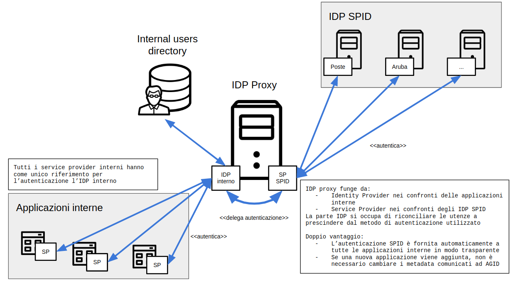

# SPID Shibboleth Proxy

Shibboleth IDP con possibilità di delegare l'autenticazione ad un IDP SPID.

⚠️ Attenzione! Questo progetto ha la finalità di esempio di base che può richiedere variazioni di configurazione in base alle specifiche necessità di ciastun ente. Apri nuove issue e raggiungici sul [canale Slack](https://developersitalia.slack.com/archives/C73R3UQE8) per contribuire.

Lo scenario di base prevede che un ente abbia un proprio Identity Provider sul quale voglia implementare la possibilità di fornire autenticazione tramite SPID.

Il setup dimostrativo contiene i seguenti elementi:

- [Shibboleth IDP](idp/README.md)
- [Shibboleth SP](sp/README.md)
- [Discovery Service](discovery-service/README.md)
- [Configurazione di Apache2 con mod_shib](apache/README.md)