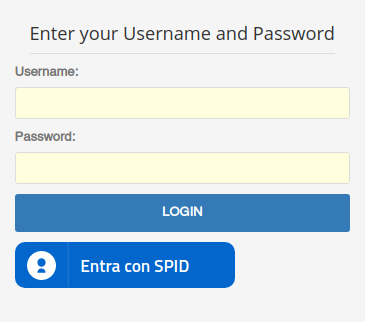

# Discovery Service

Il Discovery Service permette di indirizzare la richiesta di autenticazione agli IDP SPID mediante la selezione di 
quello richiesto.

Per il caso d'uso in questione è possibile seguire due strade, le quali richiedono diverse configurazioni:

- Bottone SPID direttamente nella pagina di login dell'IDP interno;
- Bottone SPID presente in una pagina esterna alla pagina di login dell'IDP interno.

In questa sede viene attualmente descritto il primo caso d'uso, come mostrato nella seguente figura.



## Strategia usata

Normalmente, il discovery service prevede di mostrare una pagina all'utente per la selezione dell'IDP. Ciò non 
consentirebbe di effettuare la scelta direttamente nella pagina di login, in quanto si ricorda che la vista di login è 
contenuta all'interno dell'installazione dell'IDP al percorso `$IDP_HOME/views/login.vm`.

Per ovviare a questo problema, si sfrutta il meccanismo di memorizzazione della selezione dell'IDP fornito dal discovery
service, il quale si basa sull'utilizzo di alcuni cookie, che se impostati opportunamente, permettono di saltare la 
scelta dell'IDP, inoltrando la richiesta di autenticazione a quello presente sul cookie.

I cookie da impostare sono due:

- `spididp` (il nome può essere variato), con valore 0 o 1, indicante se bisogna saltare la scelta dell'IDP o meno. Da 
  impostare sempre a 1 in questo caso.
- `_saml_idp` (il nome NON può essere variato), contenente la codifica base64 dell'EntityID dell'idp SPID da contattare.  

L'idea è pertanto quella di configurare la vista di login in modo da impostare il valore di questi due cookie via 
javascript, in risposta alla selezione dell'IDP scelto. 

Per realizzare la funzionalità bisogna effettuare due operazioni:

- [Customizzazione della configurazione del discovery service](#customizzazione-della-configurazione-del-discovery-service)
- [Personalizzazione della vista di login dell'IDP](#personalizzazione-della-vista-di-login-dellidp)

### Customizzazione della configurazione del discovery service

La modifica necessaria va apportata al file `$DISCO_SERVICE_HOME/idpselect_config.js`

```
this.autoFollowCookie = 'spididp' // il nome può essere variato
```

### Personalizzazione della vista di login dell'IDP

Le modifiche richiedono la personalizzazione del file `$IDP_HOME/views/login.vm`:

- __Importazione di jQuery__, mediante la strategia preferita (locale, cdn, etc.);

- __Assegnazione di un ID al form__: necessario per intercettare il submit del form.
```
<!-- $IDP_HOME/views/login.vm -->

...
<form action="$flowExecutionUrl" method="post" id="fm1">
...
```

- __Inserimento del bottone SPID__
```
<!-- $IDP_HOME/views/login.vm -->

        <!-- AGID - SPID IDP BUTTON LARGE "ENTRA CON SPID" * begin * -->
        <a href="#" class="italia-it-button italia-it-button-size-m button-spid" spid-idp-button="#spid-idp-button-large-post" aria-haspopup="true" aria-expanded="false">
            <span class="italia-it-button-icon"></span>
            <span class="italia-it-button-text">Entra con SPID</span>
        </a>
        <div id="spid-idp-button-large-post" class="spid-idp-button spid-idp-button-tip spid-idp-button-relative">
            <ul id="spid-idp-list-large-root-post" class="spid-idp-button-menu" aria-labelledby="spid-idp">
                <li class="spid-idp-button-link" data-idp="arubaid">
                    <button entityID="https://loginspid.aruba.it" class="idp-button-idp-logo" name="_eventId_SPID_auth" type="submit"><span class="spid-sr-only">Aruba ID</span></button>
                </li>
                <li class="spid-idp-button-link" data-idp="infocertid">
                    <button entityID="https://identity.infocert.it" class="idp-button-idp-logo" name="_eventId_SPID_auth" type="submit"><span class="spid-sr-only">Infocert ID</span></button>
                </li>
                <li class="spid-idp-button-link" data-idp="posteid">
                    <button entityID="https://posteid.poste.it" class="idp-button-idp-logo" name="_eventId_SPID_auth" type="submit"><span class="spid-sr-only">Poste ID</span></button>
                </li>
                <li class="spid-idp-button-link" data-idp="sielteid">
                    <button entityID="https://identity.sieltecloud.it" class="idp-button-idp-logo" name="_eventId_SPID_auth" type="submit"><span class="spid-sr-only">Sielte ID</span></button>
                </li>
                <li class="spid-idp-button-link" data-idp="timid">
                    <button entityID="https://login.id.tim.it/affwebservices/public/saml2sso" class="idp-button-idp-logo" name="_eventId_SPID_auth" type="submit"><span class="spid-sr-only">Tim ID</span></button>
                </li>
                <li class="spid-idp-button-link" data-idp="intesaid">
                    <button entityID="https://spid.intesa.it" class="idp-button-idp-logo" name="_eventId_SPID_auth" type="submit"><span class="spid-sr-only">Tim ID</span></button>
                </li>
                <li class="spid-idp-button-link" data-idp="lepidaid">
                    <button entityID="https://id.lepida.it/idp/shibboleth" class="idp-button-idp-logo" name="_eventId_SPID_auth" type="submit"><span class="spid-sr-only">Tim ID</span></button>
                </li>
                <li class="spid-idp-button-link" data-idp="namirialid">
                    <button entityID="https://idp.namirialtsp.com/idp" class="idp-button-idp-logo" name="_eventId_SPID_auth" type="submit"><span class="spid-sr-only">Tim ID</span></button>
                </li>
                <li class="spid-idp-button-link" data-idp="registerid">
                    <button entityID="https://spid.register.it" class="idp-button-idp-logo" name="_eventId_SPID_auth" type="submit"><span class="spid-sr-only">Tim ID</span></button>
                </li>
            </ul>
        </div>
```

- __Intercettazione del click su uno degli IDP spid__, per la modifica dei cookie:

```
<!-- $IDP_HOME/views/login.vm -->

<script type="text/javascript" src="/js/spid-sp-access-button.min.js"></script>
   <script>

         $(document).ready(function(){
            // popolamento del menu SPID
            var rootList = $("#spid-idp-list-large-root-post");
            var idpList = rootList.children(".spid-idp-button-link");
            var lnkList = rootList.children(".spid-idp-support-link");
            while (idpList.length) {
                rootList.append(idpList.splice(Math.floor(Math.random() * idpList.length), 1)[0]);
            }
            rootList.append(lnkList);
            
            // Impostazione dei cookie al submit del form
            $("#fm1").submit(function( event ) {
              var entityID = $("button[type=submit][clicked=true]").attr('entityID');
              $.removeCookie("spididp");
              $.cookie("spididp","1",{ expires: 7, path: '/' });
              $.removeCookie("_saml_idp");
              $.cookie("_saml_idp",btoa(encodeURI(entityID)),{ expires: 7, path: '/' });

            });
                    
            $("form button[type=submit]").click(function() {
             $("button[type=submit]", $(this).parents("form")).removeAttr("clicked");
             $(this).attr("clicked", "true");
            });
        });

   </script>
```